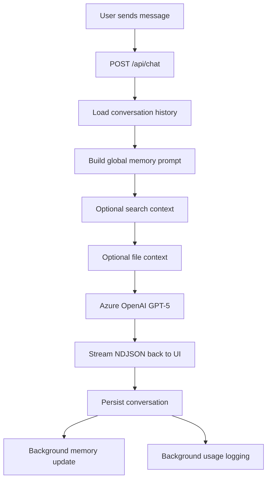
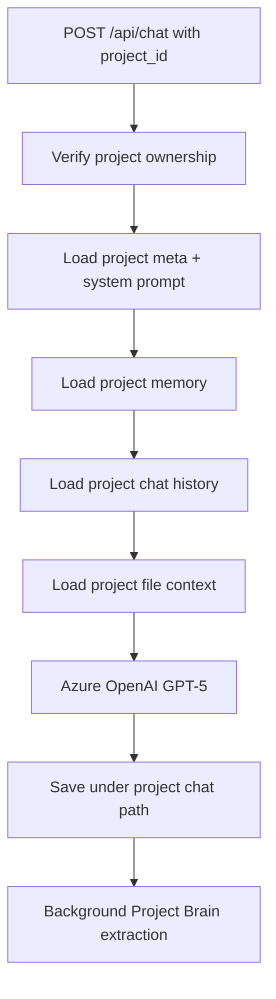
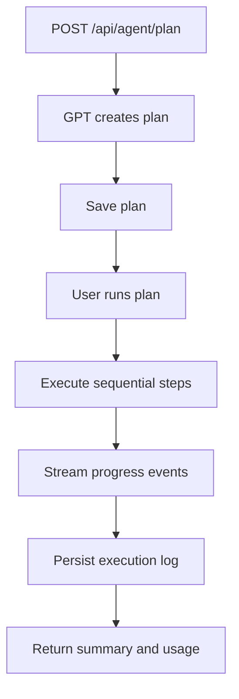
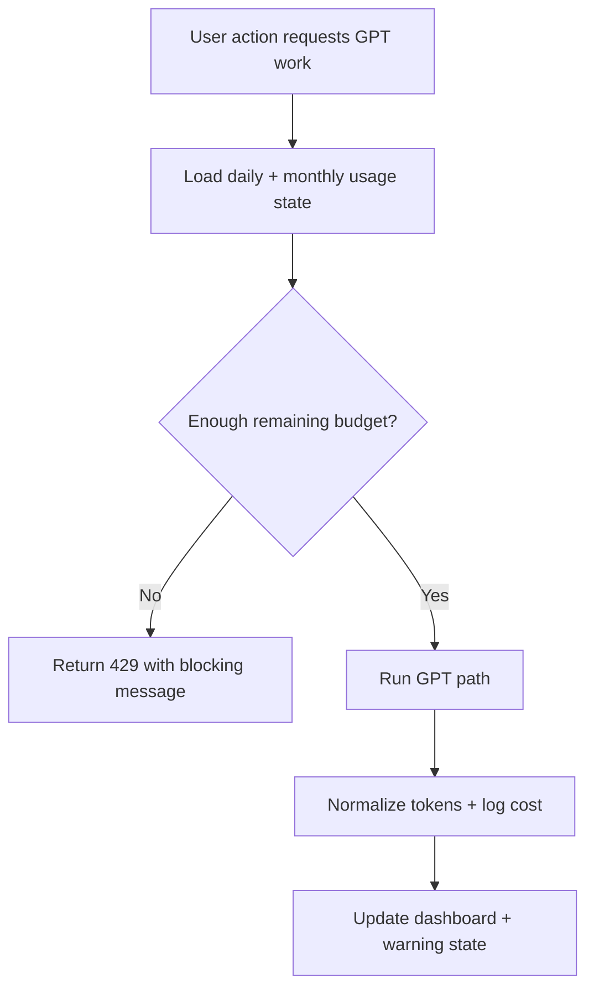

# NeuralChat

<p align="center">
  
</p>

NeuralChat is a personal AI workspace built around authenticated GPT-5 chat, persistent memory, file-grounded retrieval, plan-first agents, project-scoped workspaces, and enforced usage controls.

It is organized as:
- `frontend/` for the React + TypeScript client
- `backend/` for the FastAPI app mounted through Azure Functions ASGI
- `docs/` for architecture, deployment, and roadmap material

## Vibe And Product Direction

NeuralChat is not trying to be a generic chat clone. The current product direction is:
- one signed-in workspace shell
- clean separation between normal chat, project chat, and agent execution
- memory that stays scoped correctly
- retrieval that can use search and uploaded files without polluting unrelated work
- cost controls that are visible and enforced, not just reported after the fact

## Stack

- Frontend: React, TypeScript, Vite, Clerk React, Recharts, Markdown + KaTeX rendering
- Backend: FastAPI, Azure Functions ASGI, Pydantic, HTTPX
- Model provider: Azure OpenAI GPT-5
- Search provider: Tavily
- Agent orchestration: LangChain + LangGraph
- Storage: Azure Blob Storage
- Auth: Clerk JWT verification via JWKS
- Parsing: PyMuPDF, python-docx, multipart uploads

## Repo Layout

```text
NeuralChat/
├── backend/
│   ├── app/
│   │   ├── auth.py
│   │   ├── env_loader.py
│   │   ├── main.py
│   │   ├── schemas.py
│   │   └── services/
│   │       ├── agent.py
│   │       ├── blob_paths.py
│   │       ├── chat_service.py
│   │       ├── cost_tracker.py
│   │       ├── file_handler.py
│   │       ├── memory.py
│   │       ├── projects.py
│   │       ├── providers.py
│   │       ├── search.py
│   │       ├── storage.py
│   │       └── titles.py
│   ├── tests/
│   ├── function_app.py
│   ├── host.json
│   ├── local.settings.example.json
│   └── requirements.txt
├── frontend/
│   ├── src/
│   │   ├── api/
│   │   ├── components/
│   │   ├── pages/
│   │   ├── utils/
│   │   ├── App.tsx
│   │   ├── index.css
│   │   └── types.ts
│   ├── package.json
│   └── vite.config.ts
└── docs/
    ├── ARCHITECTURE.md
    ├── DEPLOYMENT.md
    └── ROADMAP.md
```

## Current Product Capabilities

### Auth and identity
- Clerk handles sign-in, session management, and token issuance on the frontend.
- Protected backend requests send `Authorization: Bearer <token>`.
- The backend derives `user_id` from the Clerk `sub` claim.
- Readable naming headers are supported for Blob path segments:
  - `X-User-Display-Name`
  - `X-Session-Title`

### Chat
- `POST /api/chat` supports both standard chats and project-scoped chats.
- NDJSON streaming emits `token`, `done`, and `error` events.
- Saved assistant messages can carry:
  - `search_used`
  - `file_context_used`
  - `sources`
  - timing metrics
  - token metadata

### Global memory
- Global memory is stored per user profile.
- Memory is extracted from normal chat and injected into future non-project chats.
- Supported routes:
  - `GET /api/me`
  - `PATCH /api/me/memory`
  - `DELETE /api/me/memory`

### Web search
- Tavily-backed search can be enabled from the frontend.
- Search results are cached in Blob storage.
- Search-backed answers return source metadata for UI citations.
- Search availability is exposed via `GET /api/search/status`.

### File retrieval
- Files can be uploaded into a normal chat session.
- Files can also be attached to project scope using the current project services flow.
- Raw uploads are stored once, parsed chunks are cached, and relevant chunks are reused later.
- Supported routes:
  - `POST /api/upload`
  - `GET /api/files`
  - `DELETE /api/files/{filename}`

### Conversation titles
- The frontend creates a local working title from the first prompt.
- The backend can refine it using `POST /api/conversations/title`.
- The same title is reused in readable session path naming.

### Agent Mode
- Agent Mode is deliberately separate from normal chat.
- The current workflow is:
  1. create a plan
  2. show the plan in-thread
  3. run it explicitly
  4. stream progress and final summary
- Supported routes:
  - `POST /api/agent/plan`
  - `POST /api/agent/run/{plan_id}`
  - `GET /api/agent/history`
  - `GET /api/agent/history/{plan_id}`

### Cost monitoring and limits
- Every billed GPT path logs token usage and estimated spend.
- Usage is aggregated per user.
- The app now supports both daily and monthly limits.
- Limits are enforced before GPT-backed work starts.
- The frontend shows warning and blocked states.
- Supported routes:
  - `GET /api/usage/summary`
  - `GET /api/usage/today`
  - `GET /api/usage/status`
  - `GET /api/usage/limit`
  - `PATCH /api/usage/limit`

### Projects
- Projects are real workspace objects, not placeholders.
- Each project has isolated:
  - metadata
  - chats
  - Project Brain memory
  - files and parsed file chunks
- Each project chat can teach Project Brain new template-specific facts in the background.
- The project workspace currently exposes:
  - routed project pages
  - project chat creation and deletion
  - Project Brain completeness
  - inline memory editing
  - Project Brain reset
  - recent learning activity
- Public template route:
  - `GET /api/projects/templates`
- Protected project routes:
  - `GET /api/projects`
  - `POST /api/projects`
  - `GET /api/projects/{project_id}`
  - `PATCH /api/projects/{project_id}`
  - `DELETE /api/projects/{project_id}`
  - `GET /api/projects/{project_id}/memory`
  - `PATCH /api/projects/{project_id}/memory`
  - `DELETE /api/projects/{project_id}/memory`
  - `GET /api/projects/{project_id}/brain-log`
  - `GET /api/projects/{project_id}/chats`
  - `GET /api/projects/{project_id}/chats/{session_id}`
  - `POST /api/projects/{project_id}/chats`
  - `DELETE /api/projects/{project_id}/chats/{session_id}`

## Frontend Surface Map

### Main app shell
The frontend shell in `frontend/src/App.tsx` currently coordinates:
- authentication state
- route handling
- standard chat and project chat flows
- NDJSON stream consumption
- notifications
- cost-limit blocking
- settings and agent panels

### Main pages
- `pages/ProjectsPage.tsx`: project index, template-first creation flow
- `pages/ProjectWorkspacePage.tsx`: project overview with chats, Project Brain, and file/memory context surfaces

### Main components
- `components/Sidebar.tsx`: navigation, projects list, recents, workspace shortcuts
- `components/ChatWindow.tsx`: transcript rendering and chat-body orchestration
- `components/MessageBubble.tsx`: message rendering, markdown/code/math display
- `components/FileUpload.tsx` and `components/FileList.tsx`: file handling UI
- `components/ProjectBrainPanel.tsx`: Project Brain completeness and memory editing UI
- `components/AgentProgress.tsx`: streamed plan execution state
- `components/AgentHistory.tsx`: saved agent plans and logs
- `components/CostDashboard.tsx`: usage reporting and budget controls
- `components/CostWarningBanner.tsx`: usage warning and blocking state presentation
- `components/SettingsPanel.tsx`: general, account, and cost surfaces

## Backend Service Map

### Entry and routing
- `backend/function_app.py`: Azure Functions ASGI entrypoint
- `backend/app/main.py`: HTTP surface for chat, projects, agents, files, memory, usage, and titles

### Service responsibilities
- `services/chat_service.py`: model calls, token streaming, conversation persistence helpers
- `services/memory.py`: global memory extraction and prompt building
- `services/projects.py`: project templates, CRUD, project chat persistence, Project Brain, and project file retrieval
- `services/file_handler.py`: upload validation, parsing, chunking, and retrieval scoring
- `services/search.py`: Tavily requests and cache behavior
- `services/agent.py`: plan creation, step execution, summaries, and logs
- `services/cost_tracker.py`: token normalization, spend estimation, summaries, warnings, and hard limits
- `services/blob_paths.py`: readable canonical Blob segments with stable ids and migration helpers
- `services/storage.py`: shared storage initialization and conversation deletion helpers
- `services/titles.py`: conversation title refinement
- `services/providers.py`: provider configuration helpers

## Storage Layout

NeuralChat uses readable Blob naming while keeping stable ids embedded in every canonical path segment.

### Containers
- `neurarchat-memory`
- `neurarchat-profiles`
- `neurarchat-uploads`
- `neurarchat-parsed`
- `neurarchat-agents`

### Canonical paths

Global chat and profile data:
- `conversations/{user_segment}/{session_segment}.json`
- `profiles/{user_segment}.json`
- `usage/{user_segment}/{YYYY-MM-DD}.json`
- `search-cache/{sha256(normalized_query)}.json`

Session files:
- `{user_segment}/{session_segment}/{filename}`
- `{user_segment}/{session_segment}/{filename}.json`

Agent plans and logs:
- `{user_segment}/{session_segment}/plans/{plan_id}.json`
- `{user_segment}/{session_segment}/logs/{plan_id}.json`

Projects:
- `projects/{user_segment}/index.json`
- `projects/{user_segment}/{project_segment}/meta.json`
- `projects/{user_segment}/{project_segment}/memory.json`
- `projects/{user_segment}/{project_segment}/brain_log.json`
- `projects/{user_segment}/{project_segment}/chats/{session_segment}.json`
- `projects/{user_segment}/{project_segment}/files/{filename}`
- `projects/{user_segment}/{project_segment}/files_parsed/{filename}.json`

Legacy id-only names are migrated lazily on later reads or writes.

## System Flows

### Standard chat


### Project chat


### Agent flow


### Usage enforcement


## Project Brain Memory Shape

`GET /api/projects/{project_id}/memory` returns:

```json
{
  "memory": {
    "startup_name": "NeuralChat",
    "tech_stack": "FastAPI + React + Azure"
  },
  "completeness": {
    "percentage": 60,
    "filled_keys": ["startup_name", "tech_stack", "target_users"],
    "missing_keys": ["business_model", "stage"],
    "suggestion": "Tell me about your business model and current stage."
  }
}
```

Persisted project memory can also include:
- `last_updated`
- `_raw_facts` audit entries for learned facts

Each successful Project Brain extraction also appends to `brain_log.json` with:
- `timestamp`
- `session_id`
- `extracted_facts`
- `tokens_used`

## Delete Behavior

### Delete chat
`DELETE /api/conversations/{session_id}` removes session-scoped artifacts for that user:
- conversation history
- raw uploaded files
- parsed file chunks
- agent plans
- agent logs

It does not delete global profile memory.

### Delete project
`DELETE /api/projects/{project_id}` removes the full project subtree:
- `meta.json`
- `memory.json`
- project chats
- project files
- parsed project file chunks
- project index entry

## Local Development

### Backend
```bash
cd backend
python3 -m venv .venv
source .venv/bin/activate
pip install -r requirements.txt
func start
```

Optional direct run:

```bash
uvicorn app.main:app --reload --port 8000
```

### Frontend
```bash
cd frontend
npm install
npm run dev
```

## Environment

### Frontend `.env`
- `VITE_CLERK_PUBLISHABLE_KEY`
- `VITE_API_BASE_URL`

### Backend `local.settings.json`
- `FUNCTIONS_WORKER_RUNTIME`
- `AzureWebJobsStorage`
- `AZURE_STORAGE_CONNECTION_STRING`
- `AZURE_BLOB_MEMORY_CONTAINER`
- `AZURE_BLOB_PROFILES_CONTAINER`
- `AZURE_BLOB_UPLOADS_CONTAINER`
- `AZURE_BLOB_PARSED_CONTAINER`
- `AZURE_BLOB_AGENTS_CONTAINER`
- `CLERK_JWKS_URL`
- `CLERK_ISSUER`
- `CLERK_AUDIENCE`
- `AZURE_OPENAI_ENDPOINT`
- `AZURE_OPENAI_API_KEY`
- `AZURE_OPENAI_DEPLOYMENT_NAME`
- `AZURE_OPENAI_API_VERSION`
- `TAVILY_API_KEY`
- `MOCK_STREAM_DELAY_MS`

Use `backend/local.settings.example.json` and `frontend/.env.example` as the safe source of truth for setup values. Do not commit live secrets.

## Tests

### Backend
Current backend test files cover:
- `tests/test_agent.py`
- `tests/test_blob_naming.py`
- `tests/test_cost_tracker.py`
- `tests/test_project_brain.py`
- `tests/test_projects.py`
- `tests/test_session_delete.py`
- `tests/test_titles.py`

### Frontend
Current frontend tests cover:
- sidebar behavior
- settings and cost dashboard behavior
- project pages and Project Brain panel
- create-project auth flow
- file upload UI
- search source rendering
- brain activity indicator
- project auth retry logic

## Roadmap Direction

The next layer of work is likely to expand NeuralChat beyond the current shipped feature set.

Future areas we plan to work on include:
- MCP tools and external tool ecosystems
- richer agent tooling and broader execution abilities
- voice input and voice-based interaction patterns
- image generation workflows
- deeper multimodal understanding for images and documents
- stronger retrieval quality and provenance controls
- more advanced project knowledge workflows and workspace polish

Those items are forward-looking roadmap themes, not claims about what is already shipped.

## Supporting Docs

- Architecture: [docs/ARCHITECTURE.md](./docs/ARCHITECTURE.md)
- Deployment: [docs/DEPLOYMENT.md](./docs/DEPLOYMENT.md)
- Roadmap: [docs/ROADMAP.md](./docs/ROADMAP.md)
