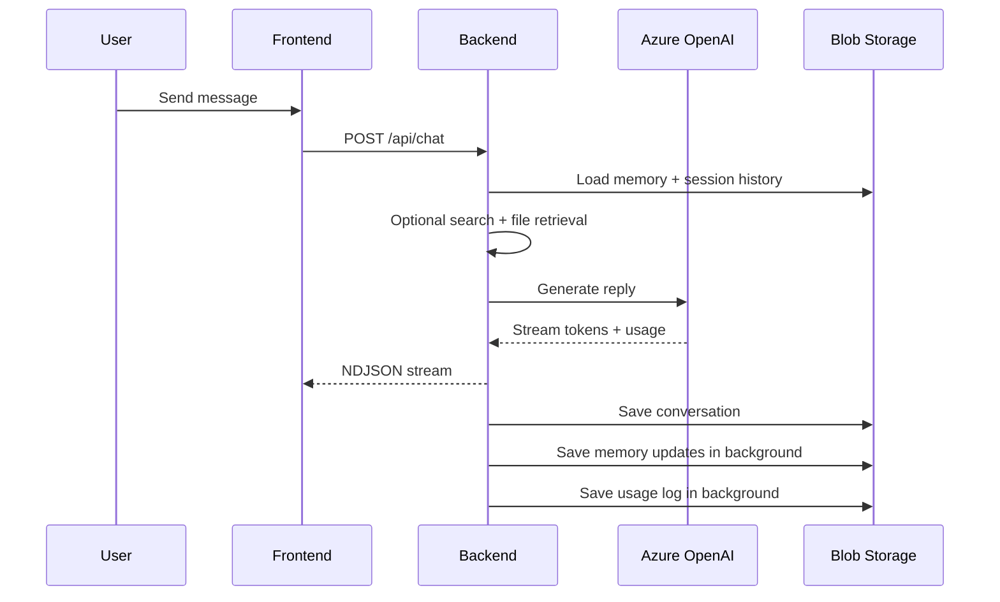

# NeuralChat

NeuralChat is a personal AI workspace built around authenticated GPT-5 chat, persistent memory, optional web search, file-grounded answers, plan-first agents, cost visibility, and dedicated project workspaces.

The app is split into:
- a React + TypeScript frontend in `frontend/`
- a FastAPI backend in `backend/`
- Azure Blob persistence for user, session, project, file, agent, and usage data

## Stack

- Frontend: React, TypeScript, Vite, `react-router-dom`, CSS-based design system, Clerk React
- Backend: FastAPI mounted through Azure Functions ASGI
- Model provider: Azure OpenAI GPT-5
- Search provider: Tavily
- Agent orchestration: LangChain + LangGraph
- Storage: Azure Blob Storage
- Auth: Clerk JWT verification via JWKS

## App Capabilities

### Auth and identity

- Clerk handles sign-in and session management on the frontend.
- Protected requests send `Authorization: Bearer <token>`.
- The backend validates the token and derives `user_id` from the Clerk `sub` claim.
- Protected requests can also include readable naming headers:
  - `X-User-Display-Name`
  - `X-Session-Title`

### Chat

- `POST /api/chat` supports normal session chat and project-scoped chat.
- NDJSON streaming returns `token`, `done`, and `error` events.
- Final chat metadata can include:
  - `search_used`
  - `file_context_used`
  - `sources`
  - timing metrics
  - token usage

### Deep memory

- Global memory is stored per user profile.
- Memory is extracted from chat and injected into later prompts.
- Global memory endpoints:
  - `GET /api/me`
  - `PATCH /api/me/memory`
  - `DELETE /api/me/memory`

### Web search

- Search availability is exposed by `GET /api/search/status`.
- Tavily results are cached in Blob.
- The frontend exposes `Web search` in the sidebar under `New chat`.
- Search-backed answers return source metadata for UI citations.

### File upload and retrieval

- Files can be uploaded into a normal chat session or into a project.
- Raw uploads are stored once, parsed chunks are cached, and relevant chunks are injected later.
- Supported APIs:
  - `POST /api/upload`
  - `GET /api/files`
  - `DELETE /api/files/{filename}`

### Hybrid conversation titles

- The frontend creates an immediate local title from the first prompt.
- The backend can refine it via:
  - `POST /api/conversations/title`
- The same refined title is reused in readable blob naming.

### Agent Mode

- Agent Mode is separate from normal chat.
- The sidebar exposes `Agent mode` under `Codex`.
- Flow:
  1. Create a plan
  2. Show the plan in-thread
  3. Explicitly run it
  4. Stream live progress and final summary
- APIs:
  - `POST /api/agent/plan`
  - `POST /api/agent/run/{plan_id}`
  - `GET /api/agent/history`
  - `GET /api/agent/history/{plan_id}`

### Cost monitoring

- Every billed GPT path logs usage and estimated spend.
- Usage is aggregated per user by day.
- Settings includes a `Cost monitoring` section with:
  - today’s spend
  - current month summary
  - feature breakdown
  - 30-day trend
  - editable daily limit
- The chat area can show a warning banner when the daily budget reaches 80%.
- APIs:
  - `GET /api/usage/summary`
  - `GET /api/usage/today`
  - `GET /api/usage/limit`
  - `PATCH /api/usage/limit`

### Projects

- `Projects` is a real workspace system, not a placeholder.
- Each project has isolated:
  - metadata
  - chats
  - project memory
  - files and parsed file chunks
- Public template endpoint:
  - `GET /api/projects/templates`
- Authenticated project endpoints:
  - `GET /api/projects`
  - `POST /api/projects`
  - `GET /api/projects/{project_id}`
  - `PATCH /api/projects/{project_id}`
  - `DELETE /api/projects/{project_id}`
  - `GET /api/projects/{project_id}/memory`
  - `GET /api/projects/{project_id}/chats`
  - `GET /api/projects/{project_id}/chats/{session_id}`
  - `POST /api/projects/{project_id}/chats`
  - `DELETE /api/projects/{project_id}/chats/{session_id}`

## Frontend UX Model

### Main navigation

Sidebar sections:
- `New chat`
- `Web search`
- `Images`
- `Apps`
- `Deep research`
- `Codex`
- `Agent mode`
- `Projects`
- project sub-items under `Projects`
- `Recents`

Top bar actions:
- sidebar collapse / mobile drawer
- route-aware page title
- `Agents`
- `Share`
- model pill / selector surface
- notification control

User menu:
- `Settings`
- `Manage account`
- theme selection
- sign out

### Settings

Settings opens from the user menu, not the main sidebar.

Settings sections:
- `General`
- `Cost monitoring`
- `Account`

### Projects routing

- `/` -> standard chat shell
- `/projects` -> projects index page
- `/projects/:projectId` -> project workspace overview
- `/projects/:projectId?chat=<session_id>` -> project-scoped chat view

## Storage Layout

NeuralChat uses readable blob naming while preserving stable ids in every path segment.

### Containers

- `neurarchat-memory`
- `neurarchat-profiles`
- `neurarchat-uploads`
- `neurarchat-parsed`
- `neurarchat-agents`

### Canonical paths

Global chat and memory:
- `conversations/{display_name__user_id}/{session_title__session_id}.json`
- `profiles/{display_name__user_id}.json`

Session files:
- `{display_name__user_id}/{session_title__session_id}/{filename}`
- `{display_name__user_id}/{session_title__session_id}/{filename}.json`

Agents:
- `{display_name__user_id}/{session_title__session_id}/plans/{plan_id}.json`
- `{display_name__user_id}/{session_title__session_id}/logs/{plan_id}.json`

Projects:
- `projects/{display_name__user_id}/index.json`
- `projects/{display_name__user_id}/{project_name__project_id}/meta.json`
- `projects/{display_name__user_id}/{project_name__project_id}/memory.json`
- `projects/{display_name__user_id}/{project_name__project_id}/chats/{session_title__session_id}.json`
- `projects/{display_name__user_id}/{project_name__project_id}/files/{filename}`
- `projects/{display_name__user_id}/{project_name__project_id}/files_parsed/{filename}.json`

Usage tracking:
- `usage/{display_name__user_id}/{YYYY-MM-DD}.json`

Search cache:
- `search-cache/{sha256(normalized_query)}.json`

Legacy id-only blob names are migrated lazily on later reads or writes.

## Visual Workflows

### Standard chat



### Project workspace

```mermaid
flowchart TD
  A[Open Projects] --> B[Projects page]
  B --> C{Has projects?}
  C -- No --> D[Template gallery]
  C -- Yes --> E[Project grid]
  D --> F[Create project modal]
  E --> G[Open project workspace]
  G --> H[Overview: chats + memory + files]
  H --> I[Open or create project chat]
  I --> J[/api/chat with project_id]
  J --> K[Project-scoped prompt, history, files, memory]
```

### Cost monitoring

```mermaid
flowchart LR
  A[Chat or agent call] --> B[Token usage extracted]
  B --> C[Daily usage JSON updated]
  C --> D[/api/usage/today]
  C --> E[/api/usage/summary]
  D --> F[Chat warning banner]
  E --> G[Settings > Cost monitoring]
```

## Delete Behavior

### Delete chat

`DELETE /api/conversations/{session_id}` performs backend cleanup, not only UI removal.

It deletes session-scoped artifacts for that user:
- conversation history
- raw uploaded files
- parsed file chunks
- agent plans
- agent logs

It does not delete user-level profile memory.

### Delete project

`DELETE /api/projects/{project_id}` removes the full project subtree:
- `meta.json`
- `memory.json`
- project chats
- project files
- parsed project file chunks
- project index entry

## Local Development

### Backend

```bash
cd backend
python3 -m venv .venv
source .venv/bin/activate
pip install -r requirements.txt
func start
```

Optional direct run:

```bash
uvicorn app.main:app --reload --port 8000
```

### Frontend

```bash
cd frontend
npm install
npm run dev
```

## Environment

### Frontend `.env`

- `VITE_CLERK_PUBLISHABLE_KEY`
- `VITE_API_BASE_URL`

### Backend `local.settings.json`

- `FUNCTIONS_WORKER_RUNTIME`
- `AzureWebJobsStorage`
- `AZURE_STORAGE_CONNECTION_STRING`
- `AZURE_BLOB_MEMORY_CONTAINER`
- `AZURE_BLOB_PROFILES_CONTAINER`
- `AZURE_BLOB_UPLOADS_CONTAINER`
- `AZURE_BLOB_PARSED_CONTAINER`
- `AZURE_BLOB_AGENTS_CONTAINER`
- `CLERK_JWKS_URL`
- `CLERK_ISSUER`
- `CLERK_AUDIENCE`
- `AZURE_OPENAI_ENDPOINT`
- `AZURE_OPENAI_API_KEY`
- `AZURE_OPENAI_DEPLOYMENT_NAME`
- `AZURE_OPENAI_API_VERSION`
- `TAVILY_API_KEY`
- `MOCK_STREAM_DELAY_MS`
