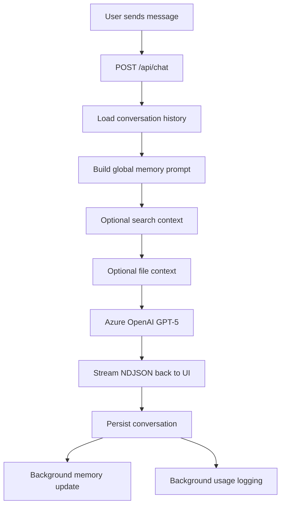
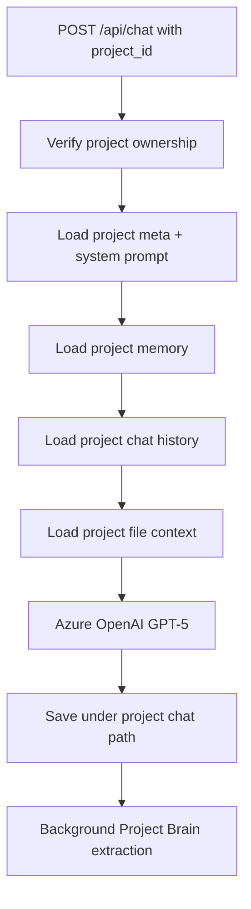
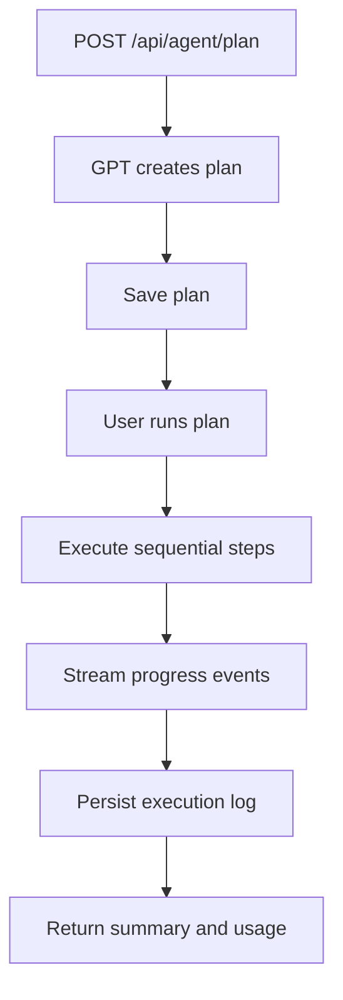
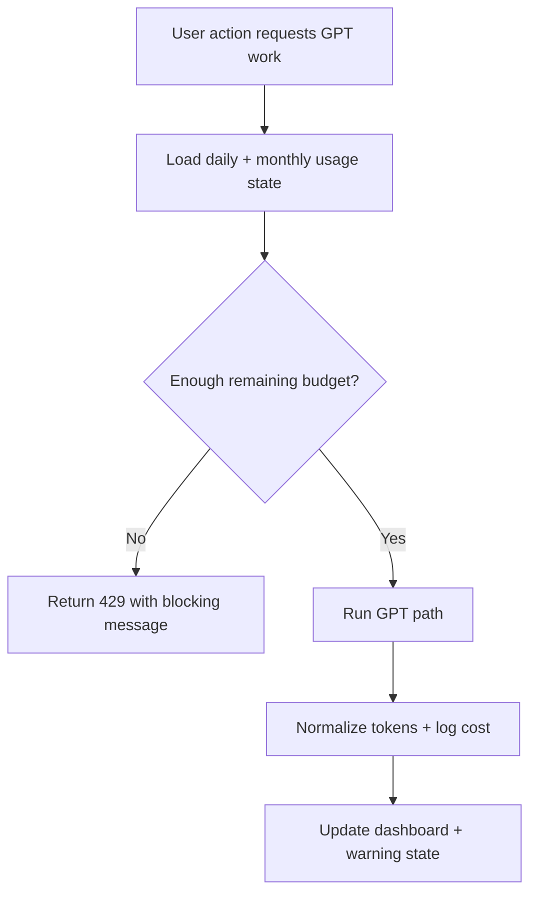
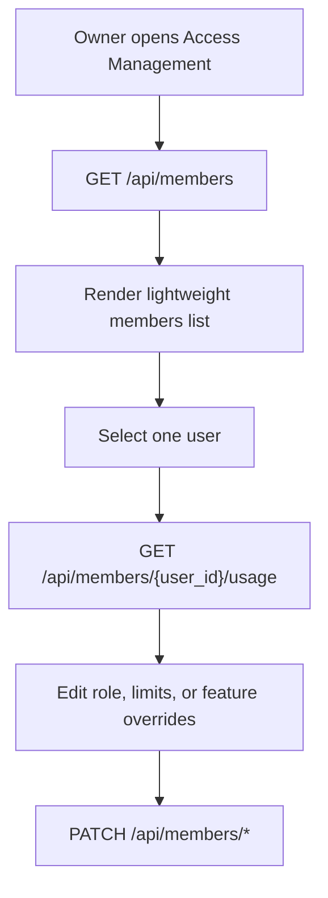

# NeuralChat

<p align="center">
  
</p>

NeuralChat is a personal AI workspace built around authenticated GPT-5 chat, persistent memory, file-grounded retrieval, project-scoped workspaces, plan-first agents, enforced usage controls, and simple owner-managed access control.

It is organized as:
- `frontend/` for the React + TypeScript client
- `backend/` for the FastAPI app mounted through Azure Functions ASGI
- `docs/` for architecture, deployment, and roadmap material

## Product Direction

NeuralChat is not trying to be a generic chat clone.

The current product direction is:
- one signed-in workspace shell
- clear separation between normal chat, project chat, and agent execution
- scoped memory that stays in the right place
- retrieval that combines uploaded files and optional search without polluting unrelated work
- visible, enforced cost controls
- owner-level workspace access and per-user governance

## Stack

- Frontend: React 18, TypeScript, Vite, Clerk React, React Query, Framer Motion, Recharts, Markdown + KaTeX rendering
- Backend: FastAPI, Azure Functions ASGI, Pydantic, HTTPX
- Model provider: Azure OpenAI GPT-5
- Search provider: Tavily
- Agent orchestration: LangChain + LangGraph
- Storage: Azure Blob Storage
- Auth: Clerk JWT verification via JWKS + Clerk Backend API
- Parsing: PyMuPDF, python-docx, multipart uploads

## Repo Layout

```text
NeuralChat/
├── backend/
│   ├── app/
│   │   ├── access.py
│   │   ├── auth.py
│   │   ├── env_loader.py
│   │   ├── main.py
│   │   ├── routers/
│   │   │   └── members.py
│   │   ├── schemas.py
│   │   └── services/
│   │       ├── agent.py
│   │       ├── blob_paths.py
│   │       ├── cache.py
│   │       ├── chat_service.py
│   │       ├── cost_tracker.py
│   │       ├── file_handler.py
│   │       ├── memory.py
│   │       ├── projects.py
│   │       ├── providers.py
│   │       ├── search.py
│   │       ├── storage.py
│   │       └── titles.py
│   ├── tests/
│   ├── function_app.py
│   ├── host.json
│   ├── local.settings.example.json
│   └── requirements.txt
├── frontend/
│   ├── public/
│   ├── src/
│   │   ├── api/
│   │   ├── components/
│   │   ├── hooks/
│   │   ├── lib/
│   │   ├── pages/
│   │   ├── scripts/
│   │   ├── utils/
│   │   ├── App.tsx
│   │   ├── main.tsx
│   │   ├── access.ts
│   │   ├── index.css
│   │   └── types.ts
│   ├── package.json
│   └── vite.config.ts
└── docs/
    ├── ARCHITECTURE.md
    ├── DEPLOYMENT.md
    └── ROADMAP.md
```

## Current Product Capabilities

### Auth and access
- Clerk handles sign-in, session management, and token issuance on the frontend.
- Protected backend requests send `Authorization: Bearer <token>`.
- The backend derives `user_id` from the Clerk `sub` claim.
- NeuralChat now uses a simple global access model:
  - `owner`
  - `member`
  - `user`
- Owners can manage:
  - user roles
  - feature overrides
  - per-user daily/monthly spend limits
  - invitations and removals
- Seeded owners can be configured through env:
  - `OWNER_EMAILS`
  - `OWNER_USER_IDS`

### Chat
- `POST /api/chat` supports both standard chats and project-scoped chats.
- NDJSON streaming emits token and completion events.
- Saved assistant messages can carry:
  - `search_used`
  - `file_context_used`
  - `sources`
  - timing metrics
  - token metadata
- Chat creation is now also checked against access-control rules and spend limits before GPT work begins.

### Global memory
- Global memory is stored per user profile.
- Memory is extracted from normal chat and injected into future non-project chats.
- Supported routes:
  - `GET /api/me`
  - `PATCH /api/me/memory`
  - `DELETE /api/me/memory`

### Web search
- Tavily-backed search can be enabled from the frontend.
- Search results are cached in Blob storage.
- Search-backed answers return source metadata for UI citations.
- Search availability is exposed via `GET /api/search/status`.

### File retrieval
- Files can be uploaded into a normal chat session.
- Files can also be attached to project scope using the current project services flow.
- Raw uploads are stored once, parsed chunks are cached, and relevant chunks are reused later.
- Supported routes:
  - `POST /api/upload`
  - `GET /api/files`
  - `DELETE /api/files/{filename}`

### Conversation titles
- The frontend creates a local working title from the first prompt.
- The backend can refine it using `POST /api/conversations/title`.
- Project chats also support refined persisted titles.

### Agent Mode
- Agent Mode is deliberately separate from normal chat.
- The current workflow is:
  1. create a plan
  2. show the plan in-thread
  3. run it explicitly
  4. stream progress and final summary
- Supported routes:
  - `POST /api/agent/plan`
  - `POST /api/agent/run/{plan_id}`
  - `GET /api/agent/history`
  - `GET /api/agent/history/{plan_id}`

### Cost monitoring and limits
- Every billed GPT path logs token usage and estimated spend.
- Usage is aggregated per user.
- The app supports both daily and monthly limits.
- Limits are enforced before GPT-backed work starts.
- Owner-facing access management can also set per-user spend caps.
- Supported routes:
  - `GET /api/usage/summary`
  - `GET /api/usage/today`
  - `GET /api/usage/status`
  - `GET /api/usage/users`
  - `GET /api/usage/limit`
  - `PATCH /api/usage/limit`

### Projects
- Projects are real workspace objects, not placeholders.
- Each project has isolated:
  - metadata
  - chats
  - Project Brain memory
  - files and parsed chunks
- Each project chat can teach Project Brain new template-specific facts in the background.
- The project workspace currently exposes:
  - routed project pages
  - project chat creation and deletion
  - Project Brain completeness
  - inline memory editing
  - Project Brain reset
  - recent learning activity
- Public template route:
  - `GET /api/projects/templates`
- Protected project routes:
  - `GET /api/projects`
  - `POST /api/projects`
  - `GET /api/projects/{project_id}`
  - `PATCH /api/projects/{project_id}`
  - `DELETE /api/projects/{project_id}`
  - `GET /api/projects/{project_id}/memory`
  - `PATCH /api/projects/{project_id}/memory`
  - `DELETE /api/projects/{project_id}/memory`
  - `GET /api/projects/{project_id}/brain-log`
  - `GET /api/projects/{project_id}/chats`
  - `GET /api/projects/{project_id}/chats/{session_id}`
  - `POST /api/projects/{project_id}/chats`
  - `PATCH /api/projects/{project_id}/chats/{session_id}`
  - `DELETE /api/projects/{project_id}/chats/{session_id}`

### Access management
- Owners can view a lightweight members directory from Settings.
- Selected-user usage is fetched separately for a faster first load.
- Owners can:
  - invite users
  - change roles
  - override features
  - set per-user daily/monthly limits
  - remove users
- Supported routes:
  - `GET /api/members`
  - `GET /api/members/{user_id}/usage`
  - `POST /api/members/invite`
  - `PATCH /api/members/{user_id}/role`
  - `PATCH /api/members/{user_id}/features`
  - `PATCH /api/members/{user_id}/usage-limit`
  - `DELETE /api/members/{user_id}`

## Frontend Surface Map

### Main app shell
The frontend shell in `frontend/src/App.tsx` currently coordinates:
- authentication state
- route handling
- standard chat and project chat flows
- NDJSON stream consumption
- notifications
- cost-limit blocking
- access-aware UI actions
- settings and agent panels

### App bootstrap
`frontend/src/main.tsx` currently sets up:
- `ClerkProvider`
- `QueryClientProvider`
- browser routing
- persisted theme mode
- production keep-alive startup for `/api/keep-warm`

### Main pages
- `pages/ProjectsPage.tsx`: project index and project creation flow
- `pages/ProjectWorkspacePage.tsx`: project overview with chats, Project Brain, and file/memory context

### Main components
- `components/Sidebar.tsx`: navigation, projects list, recents, workspace shortcuts, access-aware actions
- `components/ChatWindow.tsx`: transcript rendering and chat-body orchestration
- `components/MessageBubble.tsx`: message rendering, markdown/code/math display
- `components/FileUpload.tsx` and `components/FileList.tsx`: file handling UI
- `components/ProjectBrainPanel.tsx`: Project Brain completeness and memory editing UI
- `components/AgentProgress.tsx`: streamed plan execution state
- `components/AgentHistory.tsx`: saved agent plans and logs
- `components/CostDashboard.tsx`: usage reporting and budget controls
- `components/AccessManagementPanel.tsx`: owner-facing access and per-user budget management
- `components/SettingsPanel.tsx`: general, account, cost, and access sections
- `components/NeuralNetworkLogo.tsx`: animated new-chat hero logo

## Frontend Data and Caching

NeuralChat now uses layered client-side caching and loading behavior to reduce cold-start pain and blank screens.

### React Query
- `frontend/src/lib/queryClient.ts` configures shared query behavior.
- `frontend/src/hooks/useApi.ts` provides generic stale-while-revalidate queries.
- `frontend/src/hooks/usePrefetch.ts` prefetches common endpoints on app load.
- `frontend/src/components/DataLoader.tsx` and `SkeletonCard.tsx` keep previously loaded data visible during background refreshes.

### Keep-warm behavior
- `GET /api/keep-warm` exists on the backend as a lightweight warm-path endpoint.
- `frontend/src/scripts/keepAlive.ts` pings it in production to reduce Azure Function cold-start pain while an active session is open.

## Backend Service Map

### Entry and routing
- `backend/function_app.py`: Azure Functions ASGI entrypoint
- `backend/app/main.py`: HTTP surface for chat, projects, agents, files, memory, usage, access, and titles

### Service responsibilities
- `services/chat_service.py`: model calls, token streaming, conversation persistence helpers
- `services/memory.py`: global memory extraction and prompt building
- `services/projects.py`: project templates, CRUD, project chat persistence, Project Brain, and project file retrieval
- `services/file_handler.py`: upload validation, parsing, chunking, and retrieval scoring
- `services/search.py`: Tavily requests and cache behavior
- `services/agent.py`: plan creation, step execution, summaries, and logs
- `services/cost_tracker.py`: token normalization, spend estimation, summaries, warnings, hard limits, and per-user usage reads
- `services/cache.py`: in-memory TTL cache for read-heavy GET routes
- `services/blob_paths.py`: readable canonical Blob segments with stable ids and migration helpers
- `services/storage.py`: shared storage initialization and conversation deletion helpers
- `services/titles.py`: conversation title refinement
- `services/providers.py`: provider configuration helpers

## Storage Layout

NeuralChat uses readable Blob naming while keeping stable ids embedded in every canonical path segment.

### Containers
- `neurarchat-memory`
- `neurarchat-profiles`
- `neurarchat-uploads`
- `neurarchat-parsed`
- `neurarchat-agents`

### Canonical paths

Global chat and profile data:
- `conversations/{user_segment}/{session_segment}.json`
- `profiles/{user_segment}.json`
- `usage/{user_segment}/{YYYY-MM-DD}.json`
- `search-cache/{sha256(normalized_query)}.json`

Session files:
- `{user_segment}/{session_segment}/{filename}`
- `{user_segment}/{session_segment}/{filename}.json`

Agent plans and logs:
- `{user_segment}/{session_segment}/plans/{plan_id}.json`
- `{user_segment}/{session_segment}/logs/{plan_id}.json`

Projects:
- `projects/{user_segment}/index.json`
- `projects/{user_segment}/{project_segment}/meta.json`
- `projects/{user_segment}/{project_segment}/memory.json`
- `projects/{user_segment}/{project_segment}/brain_log.json`
- `projects/{user_segment}/{project_segment}/chats/{session_segment}.json`
- `projects/{user_segment}/{project_segment}/files/{filename}`
- `projects/{user_segment}/{project_segment}/files_parsed/{filename}.json`

Legacy id-only names are migrated lazily on later reads or writes.

## System Flows

### Standard chat


### Project chat


### Agent flow


### Usage enforcement


### Access management


## Local Setup

### Frontend
```bash
cd frontend
npm install
npm run dev
```

Required frontend env values include:
- `VITE_CLERK_PUBLISHABLE_KEY`
- `VITE_API_BASE_URL`
- `VITE_ENABLE_KEEP_ALIVE`

### Backend
```bash
cd backend
python -m venv .venv
source .venv/bin/activate
pip install -r requirements.txt
func start
```

Use `local.settings.example.json` as the template for backend configuration.
Important values include:
- Azure Storage connection strings
- Azure OpenAI settings
- Clerk JWKS / issuer config
- `CLERK_SECRET_KEY`
- `OWNER_EMAILS`
- `OWNER_USER_IDS`
- `TAVILY_API_KEY`

## Tests

Backend test coverage includes:
- agents
- blob naming
- cache behavior
- cost tracking and enforcement
- project CRUD and cleanup
- Project Brain behavior
- title generation

Frontend tests cover focused areas such as:
- project creation and workspace views
- settings surfaces
- cost dashboard behavior
- sidebar behavior
- file upload
- search rendering
- agent progress

## Roadmap Direction

Likely next areas include:
- MCP tools and external tool connectivity
- richer multi-step agents and deeper tool execution
- voice input and voice-driven interactions
- image generation workflows
- multimodal understanding for images and documents
- stronger retrieval quality and provenance
- more advanced collaboration and admin workflows
