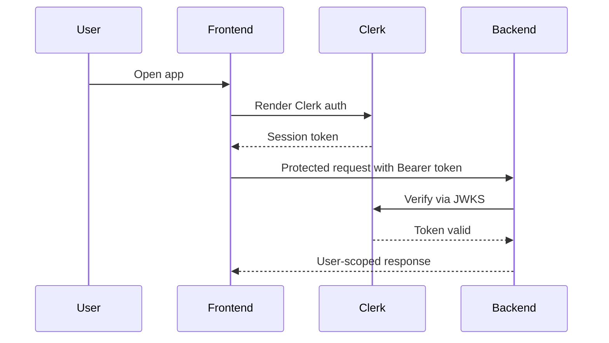
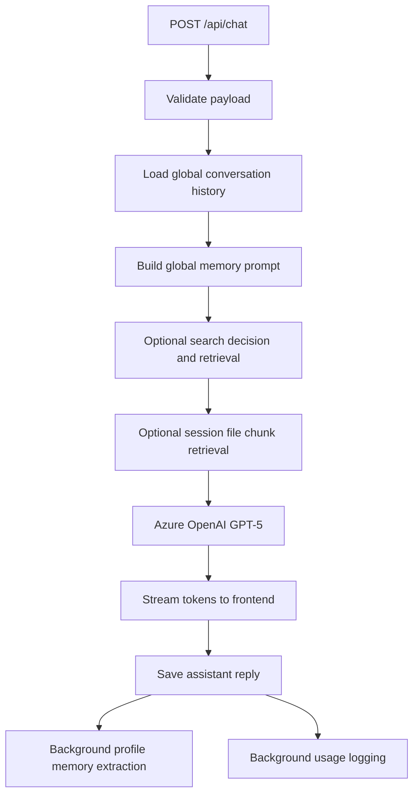
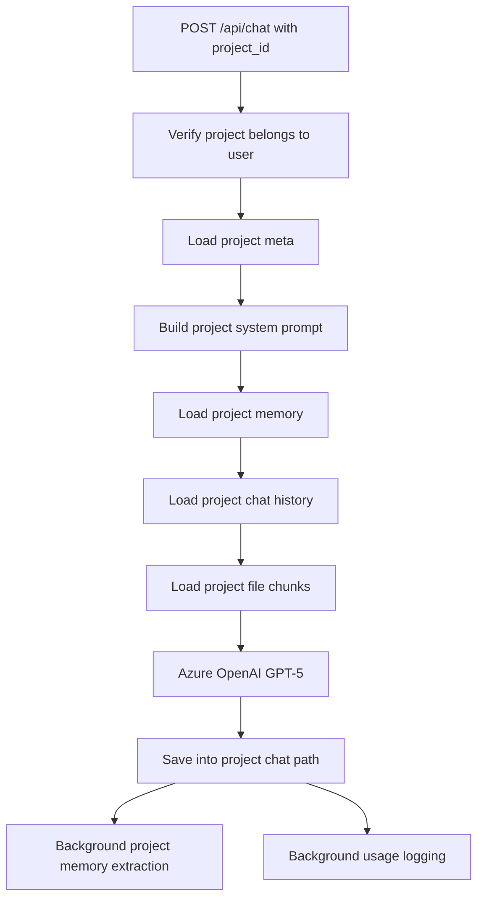
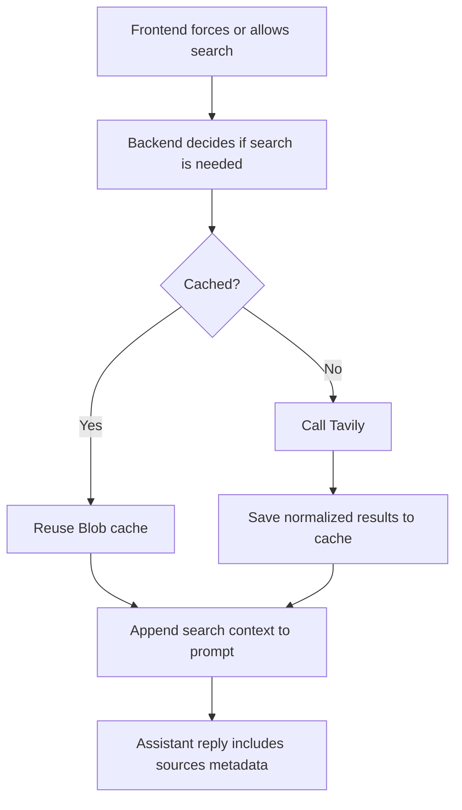
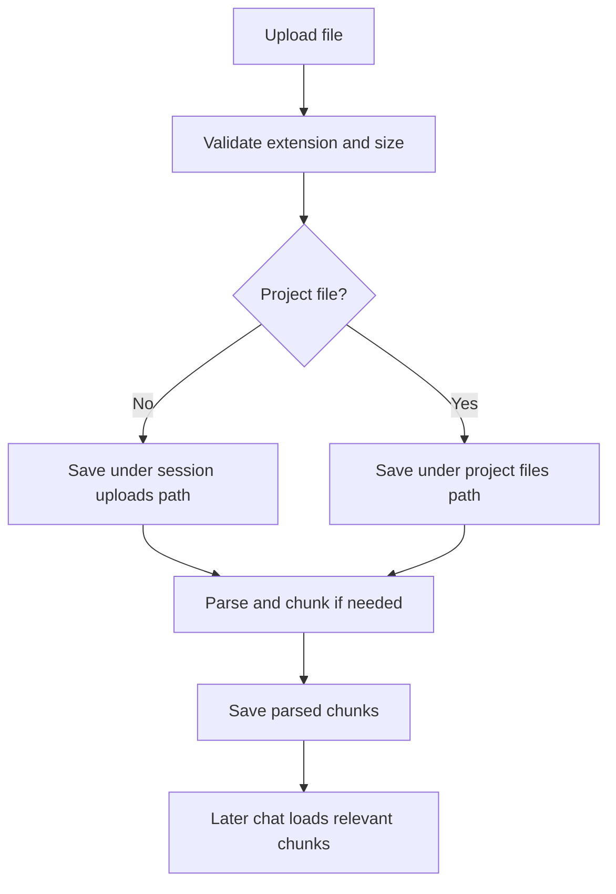
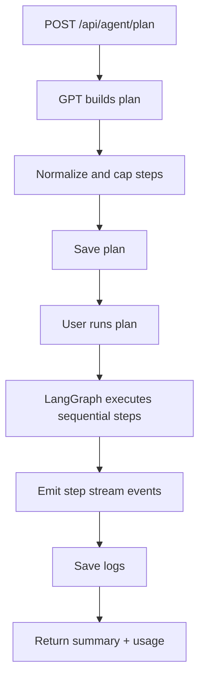
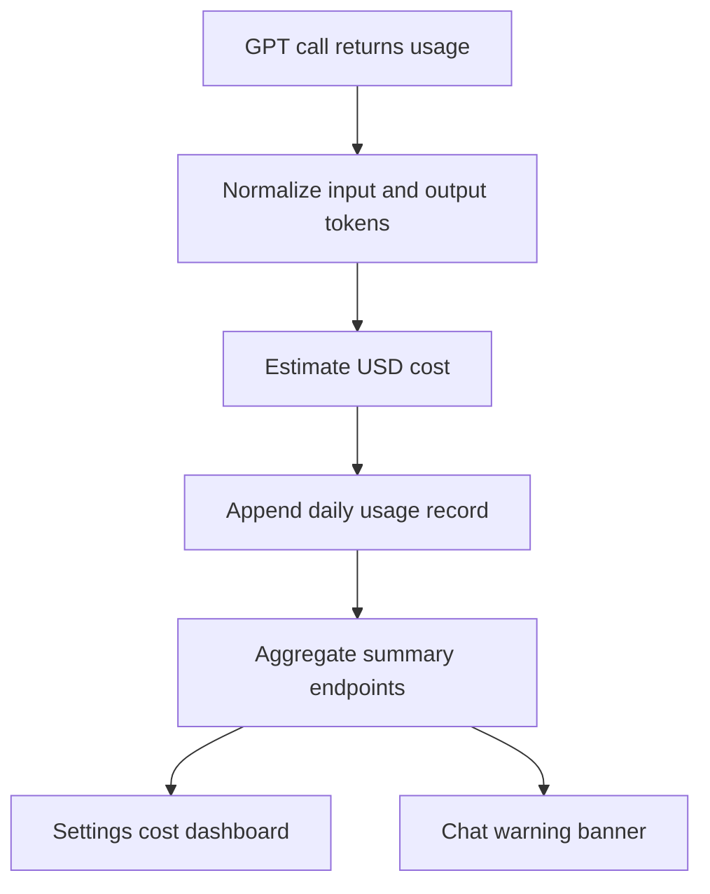

# NeuralChat Architecture

NeuralChat is organized around a single signed-in application shell backed by FastAPI on Azure Functions. The system separates user-level memory from session-level chat artifacts and project-level workspaces, while keeping Azure Blob paths readable through stable-id-aware naming helpers.

## Runtime Components

### Frontend

- React + TypeScript application mounted through Vite
- Browser routing with `react-router-dom`
- Clerk for sign-in shell and token retrieval
- CSS-based component system for app chrome, panels, pages, and modals
- NDJSON stream consumers for chat and agent execution

### Backend

- FastAPI app in `backend/app/main.py`
- Azure Functions entrypoint in `backend/function_app.py`
- Service modules for:
  - chat orchestration
  - global memory
  - project workspaces
  - file handling
  - titles
  - search
  - agents
  - usage / cost tracking
  - blob path naming and migration

### External services

- Clerk for identity and JWT verification
- Azure OpenAI GPT-5 for chat, memory extraction, title refinement, and agents
- Tavily for search
- Azure Blob Storage for persistence

## Identity Model

### Stable ownership

Authorization and ownership always depend on:
- `user_id` from Clerk JWT `sub`
- `session_id` from request payload or route/query context
- `project_id` when a request is project-scoped

### Readable naming

Protected frontend requests may include:
- `X-User-Display-Name`
- `X-Session-Title`

These values are used for readable Blob path segments only. Stable ids remain embedded in canonical paths.

Examples:
- user segment: `abdul-hanan__user_abc123`
- session segment: `prd-review__session_xyz789`
- project segment: `ai-engineer__project_abcd1234`

### Lazy migration

Older id-only blob names remain readable. When touched later, the backend migrates them to canonical readable paths.

## Storage Layout

### `neurarchat-memory`

Global:
- `conversations/{user_segment}/{session_segment}.json`
- `search-cache/{query_hash}.json`
- `usage/{user_segment}/{YYYY-MM-DD}.json`

Projects:
- `projects/{user_segment}/index.json`
- `projects/{user_segment}/{project_segment}/meta.json`
- `projects/{user_segment}/{project_segment}/memory.json`
- `projects/{user_segment}/{project_segment}/chats/{session_segment}.json`

### `neurarchat-profiles`

- `profiles/{user_segment}.json`

### `neurarchat-uploads`

Global session files:
- `{user_segment}/{session_segment}/{filename}`

Project files:
- `projects/{user_segment}/{project_segment}/files/{filename}`

### `neurarchat-parsed`

Global parsed chunks:
- `{user_segment}/{session_segment}/{filename}.json`

Project parsed chunks:
- `projects/{user_segment}/{project_segment}/files_parsed/{filename}.json`

### `neurarchat-agents`

- `{user_segment}/{session_segment}/plans/{plan_id}.json`
- `{user_segment}/{session_segment}/logs/{plan_id}.json`

## System Flows

### 1. Auth flow



### 2. Standard chat flow



### 3. Project chat flow



### 4. Search flow



### 5. File flow



### 6. Agent flow



### 7. Cost monitoring flow



## Memory Architecture

### Global memory

Global memory is user-level and stored in `profiles/{user_segment}.json`.

It supports:
- automatic extraction from normal chat
- manual read/update/clear endpoints
- prompt injection for future non-project chats
- `daily_limit_usd` storage for cost monitoring preferences

### Project memory

Project memory is separate from global memory and stored in each project subtree.

It supports:
- template-aware fact extraction
- memory keys constrained by the selected project template
- project-specific prompt building
- no mixing with global memory

## Projects Architecture

Projects introduce a third scope alongside global user memory and session chat state.

### Project templates

The backend ships seven predefined templates:
- startup
- study
- code
- writing
- research
- job
- custom

Each template provides:
- default icon/visual identity fields
- default accent color
- label and description
- base system prompt
- tracked `memory_keys`

### Project routes and workspace states

```mermaid
flowchart LR
  A[/projects] --> B{Any projects?}
  B -- No --> C[Template gallery]
  B -- Yes --> D[Projects grid]
  D --> E[/projects/:projectId]
  E --> F[Workspace overview]
  F --> G[/projects/:projectId?chat=session_id]
  G --> H[Project-scoped chat thread]
```

### Project workspace composition

The project workspace overview combines:
- project header and template identity
- project chats list
- project memory snapshot
- project file list
- system prompt editing modal

## Frontend Shell Architecture

The app keeps one shared shell around route-driven content.

Shared frame:
- sidebar
- top bar
- notifications
- settings flow
- file modal
- agent history panel
- warning banner

Route-specific main content:
- settings page
- chat view
- projects index
- project workspace overview
- project chat thread
- placeholder workspaces for future sections

## Deletion Semantics

### Delete chat

`DELETE /api/conversations/{session_id}` removes:
- conversation history
- session files or project chat file references depending on scope
- parsed chunks for that scope
- session agent artifacts

It does not remove global profile memory.

### Delete project chat

`DELETE /api/projects/{project_id}/chats/{session_id}` removes:
- the project chat conversation
- session-scoped agent artifacts for that chat session

### Delete project

`DELETE /api/projects/{project_id}` removes the full project subtree and updates the user project index.

## Key Separation Rules

NeuralChat intentionally separates:
- user-level memory from session-level artifacts
- global chat from project chat
- global files from project files
- normal chat from Agent Mode
- cost tracking display from core chat navigation
