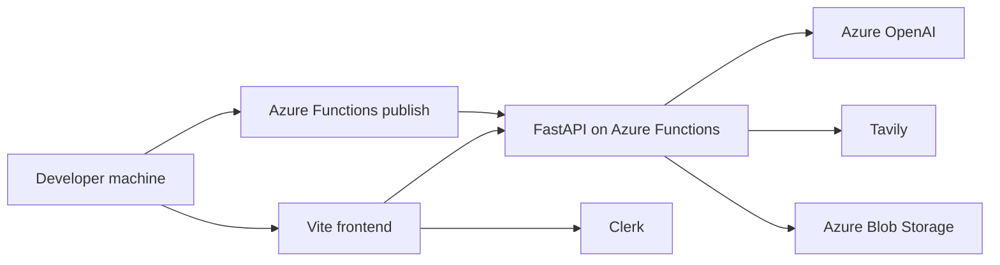
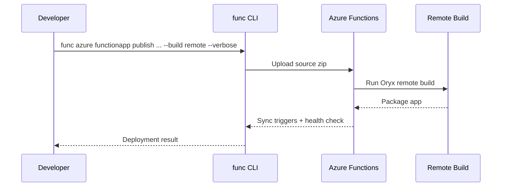
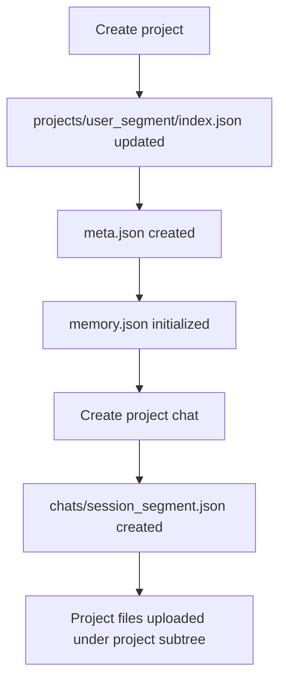

# NeuralChat Deployment

This guide describes the current local setup and Azure deployment model for NeuralChat as it exists in the codebase today.

## Runtime Shape

- Frontend: Vite + React application
- Backend: FastAPI mounted through Azure Functions ASGI
- Local backend options:
  - Azure Functions Core Tools
  - direct Uvicorn
- Hosted backend example:
  - `https://neural-chat-emg6cva3befyayd4.eastus-01.azurewebsites.net`

## Deployment Diagram



## Local Setup

### Backend

```bash
cd NeuralChat/backend
python3 -m venv .venv
source .venv/bin/activate
pip install -r requirements.txt
func start
```

Optional direct FastAPI run:

```bash
uvicorn app.main:app --reload --port 8000
```

### Frontend

```bash
cd NeuralChat/frontend
npm install
npm run dev
```

## Configuration

### Frontend `.env`

Current required values from `.env.example`:

```env
VITE_CLERK_PUBLISHABLE_KEY=pk_test_your_key_here
VITE_API_BASE_URL=https://neural-chat-emg6cva3befyayd4.eastus-01.azurewebsites.net
```

Alternate local backend values:
- `http://localhost:7071` for Azure Functions Core Tools
- `http://localhost:8000` for Uvicorn

### Backend `local.settings.json`

Current required values from `backend/local.settings.example.json`:
- `FUNCTIONS_WORKER_RUNTIME=python`
- `AzureWebJobsStorage`
- `AZURE_STORAGE_CONNECTION_STRING`
- `AZURE_BLOB_MEMORY_CONTAINER`
- `AZURE_BLOB_PROFILES_CONTAINER`
- `AZURE_BLOB_UPLOADS_CONTAINER`
- `AZURE_BLOB_PARSED_CONTAINER`
- `AZURE_BLOB_AGENTS_CONTAINER`
- `CLERK_JWKS_URL`
- `CLERK_ISSUER`
- `CLERK_AUDIENCE`
- `AZURE_OPENAI_ENDPOINT`
- `AZURE_OPENAI_API_KEY`
- `AZURE_OPENAI_DEPLOYMENT_NAME`
- `AZURE_OPENAI_API_VERSION`
- `TAVILY_API_KEY`
- `MOCK_STREAM_DELAY_MS`

## Azure App Settings

Mirror the backend settings above into Azure Function App Application Settings.

At minimum, production needs:
- Azure storage settings
- blob container names
- Clerk verification settings
- Azure OpenAI settings
- Tavily API key
- `FUNCTIONS_WORKER_RUNTIME=python`

## Azure Functions Runtime Notes

Key runtime files:
- `backend/function_app.py`
- `backend/host.json`
- `backend/requirements.txt`

Important current `host.json` behavior:
- `routePrefix` is set to `""`
- public and protected API routes are mounted directly under `/api/...`

## CORS

When the frontend runs locally and the backend is hosted on Azure, allow local Vite origins in backend CORS config.

Typical local origins:
- `http://localhost:5173`
- `http://127.0.0.1:5173`

If you later host the frontend separately, add that origin too.

## Recommended Backend Publish Flow

NeuralChat is set up for Azure Functions remote build.

Recommended command:

```bash
cd NeuralChat/backend
func azure functionapp publish Neural-Chat --build remote --verbose
```

This is more reliable than relying only on the VS Code Azure pane because it exposes the real build, sync-trigger, and health logs.

## Flex Consumption Compatibility

The project is compatible with Azure Functions Flex Consumption deployment.

The current backend structure is valid for Flex Consumption because:
- `function_app.py` is in the backend root
- `host.json` is in the backend root
- `requirements.txt` is in the backend root
- remote build can install Python dependencies correctly

## Verification Checklist

### Public endpoint checks

```bash
curl https://neural-chat-emg6cva3befyayd4.eastus-01.azurewebsites.net/api/health
curl https://neural-chat-emg6cva3befyayd4.eastus-01.azurewebsites.net/api/search/status
curl https://neural-chat-emg6cva3befyayd4.eastus-01.azurewebsites.net/api/projects/templates
```

### Browser checks

- sign in with Clerk
- send a normal chat message
- toggle `Web search` and verify a search-backed answer with sources
- upload a file and verify file list
- ask a file-grounded question
- create an agent plan and run it
- open `Settings > Cost monitoring`
- create a project from the projects page
- open a project workspace and create a project chat
- delete a chat and verify cleanup behavior

### Protected endpoint checks

Use a valid Clerk token to test:
- `/api/me`
- `/api/chat`
- `/api/upload`
- `/api/files`
- `/api/projects`
- `/api/projects/{project_id}`
- `/api/projects/{project_id}/chats`
- `/api/usage/*`
- `/api/agent/*`

Protected requests may also include:
- `X-User-Display-Name`
- `X-Session-Title`

## Operational Workflows

### Deploy backend



### Validate project storage



## Common Failure Cases

### `401 Invalid authentication token`

Usually caused by:
- expired Clerk token
- wrong `CLERK_JWKS_URL`
- wrong `CLERK_ISSUER`
- audience mismatch

### `404 Not Found` on newer endpoints

Usually caused by:
- frontend pointing to an older backend deployment
- backend not redeployed after local route changes
- stale frontend dev server using older env/bundle state

### Browser blocked requests

Usually caused by:
- wrong `VITE_API_BASE_URL`
- missing CORS origin
- mismatched hosted backend URL

### Azure storage failures

Usually caused by:
- invalid `AzureWebJobsStorage`
- invalid `AZURE_STORAGE_CONNECTION_STRING`
- missing blob containers
- local emulator issues with development storage

### Settings cost dashboard shows no data

Usually caused by:
- no GPT usage yet for that user
- backend missing `/api/usage/*` deployment
- bad auth token on usage requests

## Secret Handling

- Do not commit live `.env` or `local.settings.json` values.
- Do not paste real tokens or API keys into screenshots or logs.
- Rotate any secret that appears in terminal output, browser devtools, or public messages.
