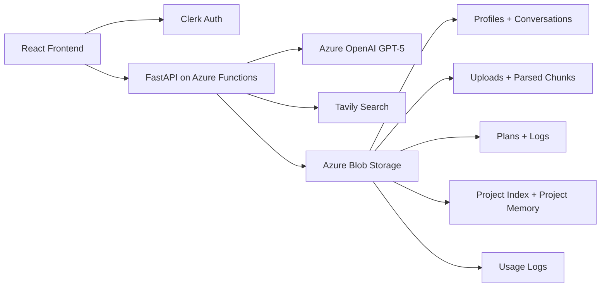

# NeuralChat Workspace

NeuralChat is a personal AI workspace with authenticated GPT-5 chat, deep memory, optional web search, file-grounded answers, plan-first agents, cost tracking, and project-scoped workspaces.

This repository is a workspace root. The actual application lives in [`NeuralChat/`](./NeuralChat).

## Workspace Map

```text
PROJECT/
├── NeuralChat/
│   ├── backend/        # FastAPI app mounted through Azure Functions ASGI
│   ├── frontend/       # React + TypeScript client
│   ├── docs/           # Architecture, deployment, roadmap
│   └── README.md       # App-level overview
├── README.md           # Workspace-level entry point
└── .gitignore
```

Maintained source and docs live in:
- `NeuralChat/backend`
- `NeuralChat/frontend`
- `NeuralChat/docs`
- `NeuralChat/README.md`

Generated or vendor folders are not documentation targets:
- `.venv`
- `node_modules`
- `dist`
- `.pytest_cache`
- local emulator/cache folders

## Current Product Scope

NeuralChat currently supports:
- Clerk authentication and JWT-backed backend protection
- GPT-5 chat through Azure OpenAI
- NDJSON streaming responses
- user-level memory extraction and recall
- optional Tavily-backed web search with caching and citations
- session-scoped file upload, parsing, and retrieval
- plan-first Agent Mode with stored history
- cost monitoring with daily usage tracking and budget warning
- project workspaces with isolated chats, memory, and files
- Azure Blob persistence with readable naming and stable ids

## High-Level Architecture



## Main Runtime Flows

### Standard chat

```mermaid
flowchart TD
  A[User sends message] --> B[Frontend sends auth token + session metadata]
  B --> C[/api/chat]
  C --> D[Load memory]
  D --> E[Optional search]
  E --> F[Optional file context]
  F --> G[Azure OpenAI reply]
  G --> H[Stream NDJSON back to UI]
  H --> I[Persist conversation]
  I --> J[Background memory extraction]
  I --> K[Background usage logging]
```

### Project chat

```mermaid
flowchart TD
  A[User opens project chat] --> B[/api/chat with project_id]
  B --> C[Verify project ownership]
  C --> D[Load project system prompt]
  D --> E[Load project memory]
  E --> F[Load project chat history]
  F --> G[Optional project file context]
  G --> H[Azure OpenAI reply]
  H --> I[Save under project chat path]
  I --> J[Background project memory update]
```

### Cost monitoring

```mermaid
flowchart TD
  A[GPT call completes] --> B[Normalize usage tokens]
  B --> C[Append daily usage record]
  C --> D[usage/display_name__user_id/YYYY-MM-DD.json]
  D --> E[/api/usage/today and /api/usage/summary]
  E --> F[Settings > Cost monitoring]
  E --> G[Chat warning banner at 80 percent]
```

## Where To Start

- App overview: [NeuralChat/README.md](./NeuralChat/README.md)
- Architecture details: [NeuralChat/docs/ARCHITECTURE.md](./NeuralChat/docs/ARCHITECTURE.md)
- Deployment guide: [NeuralChat/docs/DEPLOYMENT.md](./NeuralChat/docs/DEPLOYMENT.md)
- Forward roadmap: [NeuralChat/docs/ROADMAP.md](./NeuralChat/docs/ROADMAP.md)
