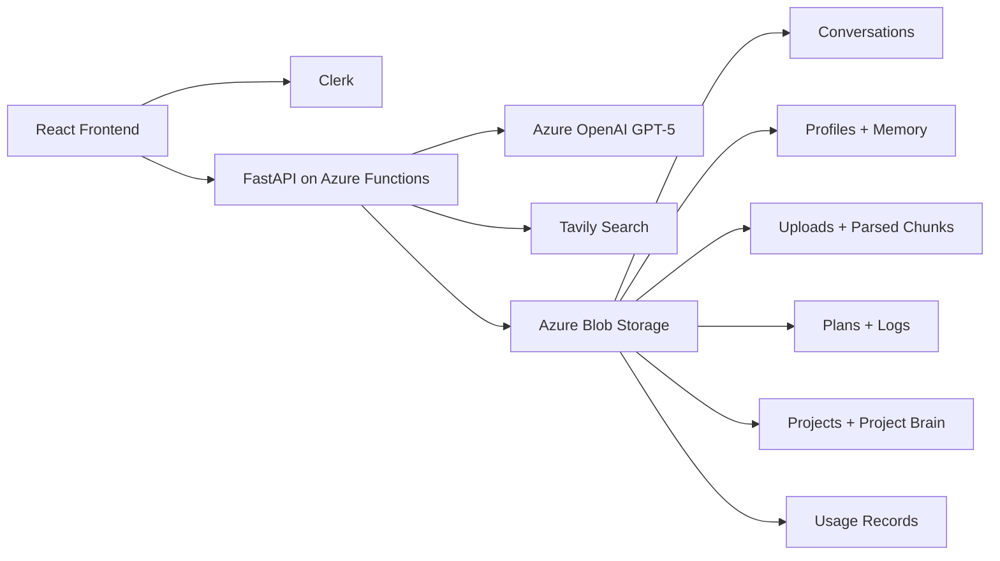

# NeuralChat

<p align="center">
  
</p>

[](./NeuralChat/README.md)
[](./NeuralChat/frontend)
[](./NeuralChat/backend)
[](./NeuralChat/README.md#auth-and-identity)
[](./NeuralChat/README.md#storage-layout)
[](./NeuralChat/README.md#stack)

NeuralChat is a personal AI workspace for authenticated GPT-5 chat, memory, project-scoped collaboration, file-grounded answers, plan-first agents, and budget-aware usage controls.

This repository is the workspace root. The application itself lives in [`NeuralChat/`](./NeuralChat).

## What NeuralChat Is

NeuralChat is built as a practical AI operating surface rather than a single chat box.

Today it already supports:
- authenticated GPT-5 chat with NDJSON streaming
- global user memory that is extracted and reused across normal chats
- optional Tavily-backed web search with cached sources
- file-grounded answers from uploaded documents
- project workspaces with isolated chats, memory, and files
- Project Brain background learning per project
- plan-first Agent Mode with saved plans and execution logs
- daily and monthly usage controls with real backend enforcement
- Azure Blob persistence with readable naming and stable ids

## Workspace Map

```text
PROJECT/
├── NeuralChat/
│   ├── backend/        # FastAPI app mounted through Azure Functions ASGI
│   ├── frontend/       # React + TypeScript client
│   ├── docs/           # Architecture, deployment, roadmap
│   └── README.md       # App-level technical reference
├── README.md           # Root showcase + navigation
└── .gitignore
```

## Product Surfaces

### Core chat
- standard authenticated chat flow
- model selection
- streaming token responses
- conversation history and sharing
- session files for grounded answers

### Research and retrieval
- optional web search with source metadata
- Blob-backed search cache
- file parsing and chunk reuse
- project-specific context isolation

### Projects
- project templates
- isolated project chats
- Project Brain completeness and memory editing
- project file support
- routed workspace pages and project chat shell

### Agent Mode
- create a plan first
- run it explicitly
- stream progress in-thread
- save plan and log history per session

### Cost monitoring
- usage summary by feature
- daily and monthly limits
- warning banners
- hard blocking before GPT calls when limits are reached

## Architecture At A Glance



## Stack

- Frontend: React, TypeScript, Vite, Clerk React, custom CSS system, Recharts, Markdown + KaTeX rendering
- Backend: FastAPI, Azure Functions ASGI, Pydantic, HTTPX
- Model provider: Azure OpenAI GPT-5
- Search provider: Tavily
- Agent orchestration: LangChain + LangGraph
- Storage: Azure Blob Storage
- Auth: Clerk JWT verification through JWKS
- Document parsing: PyMuPDF, python-docx, multipart upload handling

## What Is In The Codebase Right Now

### Frontend
Key current areas in `NeuralChat/frontend/src/`:
- `App.tsx`: application shell, routing, chat orchestration, notifications, usage gating
- `components/Sidebar.tsx`: primary navigation and workspace switching
- `components/ChatWindow.tsx` and `components/MessageBubble.tsx`: chat transcript rendering
- `components/ProjectBrainPanel.tsx`: project memory visibility and editing
- `components/AgentProgress.tsx` and `components/AgentHistory.tsx`: plan-first agent UX
- `components/CostDashboard.tsx` and `components/CostWarningBanner.tsx`: budget controls and warnings
- `pages/ProjectsPage.tsx` and `pages/ProjectWorkspacePage.tsx`: projects index and workspace views
- `api/`: typed frontend clients for chat, usage, agent, and project routes

### Backend
Key current areas in `NeuralChat/backend/app/`:
- `main.py`: FastAPI routes and request orchestration
- `auth.py`: Clerk token validation and user extraction
- `services/chat_service.py`: GPT chat generation and streaming
- `services/memory.py`: global memory extraction and prompt building
- `services/projects.py`: project CRUD, project chats, Project Brain, and project files
- `services/file_handler.py`: upload validation, parsing, chunking, and retrieval
- `services/agent.py`: plan generation, execution, and persisted logs
- `services/cost_tracker.py`: usage logging, summaries, budgets, and enforcement
- `services/search.py`: Tavily search and cache handling
- `services/blob_paths.py`: readable Blob path naming and migration helpers

### Tests
Current automated coverage includes:
- agent flows
- blob naming
- cost tracking and enforcement
- project CRUD and cleanup
- Project Brain behavior
- title generation
- frontend components for projects, settings, costs, sidebar, file upload, and search rendering

## API Surface Snapshot

Public endpoints:
- `GET /api/health`
- `GET /api/search/status`
- `GET /api/projects/templates`

Protected endpoint groups:
- `/api/chat`
- `/api/me` and `/api/me/memory`
- `/api/upload`, `/api/files`, `/api/conversations/*`
- `/api/projects/*`
- `/api/agent/*`
- `/api/usage/*`
- `/api/conversations/title`

For the detailed route map, storage layout, and deployment notes, use the app-level docs below.

## Docs

- App overview and technical reference: [NeuralChat/README.md](./NeuralChat/README.md)
- Architecture: [NeuralChat/docs/ARCHITECTURE.md](./NeuralChat/docs/ARCHITECTURE.md)
- Deployment: [NeuralChat/docs/DEPLOYMENT.md](./NeuralChat/docs/DEPLOYMENT.md)
- Roadmap: [NeuralChat/docs/ROADMAP.md](./NeuralChat/docs/ROADMAP.md)

## Future Direction

We are intentionally building NeuralChat in a way that can grow into a broader AI workspace.

Planned and likely next areas include:
- MCP tools and external tool connectivity
- richer multi-step agents and deeper agent tooling
- voice input and voice-driven interactions
- image generation workflows
- multimodal understanding for images and documents
- stronger retrieval quality and provenance
- more advanced project workspaces and collaboration patterns

Those items are roadmap directions, not shipped features unless they are explicitly documented as present in the app-level README or code.

## Where To Start

If you want the real implementation details first:
1. Read [NeuralChat/README.md](./NeuralChat/README.md)
2. Check [NeuralChat/docs/ARCHITECTURE.md](./NeuralChat/docs/ARCHITECTURE.md)
3. Use [NeuralChat/docs/DEPLOYMENT.md](./NeuralChat/docs/DEPLOYMENT.md) for local or Azure setup
