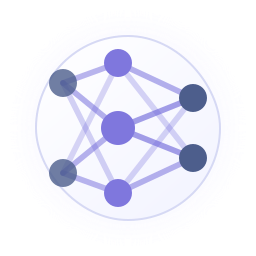
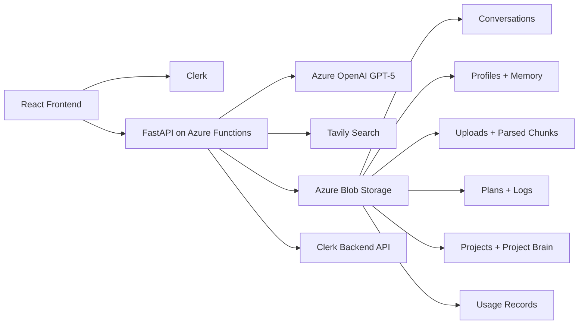

# NeuralChat

<p align="center">
  
</p>

[](./NeuralChat/README.md)
[](./NeuralChat/frontend)
[](./NeuralChat/backend)
[](./NeuralChat/README.md#auth-and-access)
[](./NeuralChat/README.md#storage-layout)
[](./NeuralChat/README.md#stack)

NeuralChat is a personal AI workspace for authenticated GPT-5 chat, persistent memory, project-scoped collaboration, file-grounded answers, plan-first agents, enforced usage limits, and owner-managed access controls.

This repository is the workspace root. The app itself lives in [`NeuralChat/`](./NeuralChat).

## What NeuralChat Is

NeuralChat is built as an AI workspace rather than a single chat box.

Today it already supports:
- authenticated GPT-5 chat with NDJSON streaming
- global user memory for standard chats
- project-scoped chat, files, and Project Brain memory
- file-grounded answers from uploaded documents
- optional Tavily-backed web search with source metadata
- plan-first Agent Mode with saved plans and execution logs
- daily and monthly usage limits with real backend enforcement
- owner-managed access control for `owner`, `member`, and `user`
- frontend caching plus backend caching to reduce cold-start and reload pain

## Workspace Map

```text
PROJECT/
├── NeuralChat/
│   ├── backend/        # FastAPI app mounted through Azure Functions ASGI
│   ├── frontend/       # React + TypeScript client
│   ├── docs/           # Architecture, deployment, roadmap
│   └── README.md       # App-level technical reference
├── README.md           # Root overview + navigation
└── .gitignore
```

## Product Areas

### Chat
- authenticated chat flow with GPT-5
- streaming token responses
- local and AI-refined conversation titles
- usage-aware request blocking when limits are reached

### Memory and retrieval
- global user memory for normal chats
- Project Brain memory for project chats
- file upload, parsing, chunk reuse, and grounded answers
- optional web search with cached sources

### Projects
- project workspaces with isolated chats
- project-level memory and files
- project chat shells and workspace views
- project templates and custom project prompts

### Agent Mode
- create a plan first
- run the plan explicitly
- stream progress into the UI
- persist plan history and execution logs

### Operations and governance
- daily and monthly usage monitoring
- enforced budgets with warning and block states
- access management for workspace users
- owner-level user role, feature, and per-user budget controls

## Architecture At A Glance



## Stack

- Frontend: React 18, TypeScript, Vite, Clerk React, React Query, Framer Motion, Recharts, Markdown + KaTeX rendering
- Backend: FastAPI, Azure Functions ASGI, Pydantic, HTTPX
- Model provider: Azure OpenAI GPT-5
- Search provider: Tavily
- Agent orchestration: LangChain + LangGraph
- Storage: Azure Blob Storage
- Auth: Clerk JWT verification and Clerk Backend API calls
- Document parsing: PyMuPDF, python-docx, multipart upload handling

## What Is In The Codebase Right Now

### Frontend
Key current areas in `NeuralChat/frontend/src/`:
- `App.tsx`: app shell, routing, chat orchestration, project switching, notifications, usage gating
- `main.tsx`: Clerk boot, React Query provider, keep-alive startup, theme initialization
- `components/Sidebar.tsx`: primary navigation and workspace switching
- `components/ChatWindow.tsx` and `components/MessageBubble.tsx`: transcript rendering
- `components/ProjectBrainPanel.tsx`: project memory visibility and editing
- `components/AgentProgress.tsx` and `components/AgentHistory.tsx`: plan-first agent UX
- `components/CostDashboard.tsx`: budget controls and usage reporting
- `components/AccessManagementPanel.tsx`: owner-facing access management UI
- `pages/ProjectsPage.tsx` and `pages/ProjectWorkspacePage.tsx`: project index and workspace views
- `api/`: typed frontend clients for chat, usage, agent, members, and project routes

### Backend
Key current areas in `NeuralChat/backend/app/`:
- `main.py`: FastAPI routes and request orchestration
- `auth.py`: Clerk token validation and user extraction
- `access.py`: global access model, owner seeding, feature overrides, member profiles
- `routers/members.py`: owner-only member list, invite, role, feature, limit, and removal routes
- `services/chat_service.py`: GPT chat generation and streaming
- `services/memory.py`: global memory extraction and prompt building
- `services/projects.py`: project CRUD, project chats, Project Brain, and project files
- `services/file_handler.py`: upload validation, parsing, chunking, and retrieval
- `services/agent.py`: plan generation, execution, and persisted logs
- `services/cost_tracker.py`: usage logging, summaries, budgets, and enforcement
- `services/cache.py`: in-memory TTL cache for read-heavy endpoints
- `services/search.py`: Tavily search and cache handling
- `services/blob_paths.py`: readable Blob path naming and migration helpers

## API Surface Snapshot

Public endpoints:
- `GET /api/health`
- `GET /api/keep-warm`
- `GET /api/search/status`
- `GET /api/projects/templates`

Protected endpoint groups:
- `/api/chat`
- `/api/me` and `/api/me/memory`
- `/api/upload`, `/api/files`, `/api/conversations/*`
- `/api/projects/*`
- `/api/agent/*`
- `/api/usage/*`
- `/api/members/*`

## Docs

- App overview and technical reference: [NeuralChat/README.md](./NeuralChat/README.md)
- Architecture: [NeuralChat/docs/ARCHITECTURE.md](./NeuralChat/docs/ARCHITECTURE.md)
- Deployment: [NeuralChat/docs/DEPLOYMENT.md](./NeuralChat/docs/DEPLOYMENT.md)
- Roadmap: [NeuralChat/docs/ROADMAP.md](./NeuralChat/docs/ROADMAP.md)

## Future Direction

NeuralChat is being built to grow into a broader AI workspace.

Likely next areas include:
- MCP tools and external tool connectivity
- richer multi-step agents and deeper tool execution
- voice input and voice-driven interactions
- image generation workflows
- multimodal understanding for images and documents
- stronger retrieval quality and provenance
- deeper collaboration and admin controls

These are roadmap directions, not shipped features unless they are explicitly documented as present in the app-level README or code.

## Where To Start

If you want the real implementation details first:
1. Read [NeuralChat/README.md](./NeuralChat/README.md)
2. Check [NeuralChat/docs/ARCHITECTURE.md](./NeuralChat/docs/ARCHITECTURE.md)
3. Use [NeuralChat/docs/DEPLOYMENT.md](./NeuralChat/docs/DEPLOYMENT.md) for local or Azure setup
